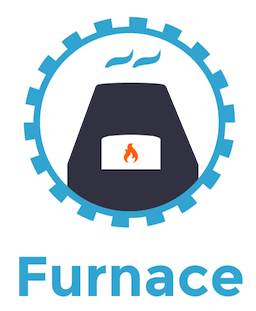

# Furnace



[](https://goreportcard.com/report/github.com/Skarlso/go-furnace) [](https://travis-ci.org/Skarlso/go-furnace)

## Intro

AWS Cloud Formation hosting with Go. This project utilises the power of AWS CloudFormation and CodeDeploy in order to
simply deploy an application into a robust, self-healing, redundant environment. The environment is configurable through
the CloudFormation Template. A sample can be found in the `templates` folder.

The application to be deployed is currently handled via GitHub, but later on, S3 based deployment will also be supported.

A sample application is provider under the `furnace-codedeploy-app` folder.

## AWS

### CloudFormation

[CloudFormation](https://aws.amazon.com/cloudformation/) as stated in the AWS documentation is an
> ...easy way to create and manage a collection of related AWS resources, provisioning and updating them in an orderly and predictable fashion.

Meaning, that via a template file it is possible to provide a description of the environment we would like to launch
are application into. How many server we would like to have? Load Balancing, and Auto Scaling setup. Own, isolated
network with VPCs. CloudFormation brings all these elements together into a bundler project called a `Stack`.
This stack can be created, updated, deleted and queried for various information.

This is what `Furnace` aims ti abstract in order to provide a very easy interface to work with complex architecture.

### CodeDeploy

[CodeDeploy](http://docs.aws.amazon.com/codedeploy/latest/userguide/welcome.html), as the documentation states
> ...coordinates application deployments to Amazon EC2 instances

In short, once the stack is up, we would like to deploy our application to the stack for usage. CodeDeploy takes care of that.
We don't have to scp something to our instances, we don't have to care if an instance goes away, or if we would like to have
a copy of that same instance. CodeDeploy can be integrated with various other services, so once we described how to deploy
our application, we never have to worry about it again. A simple `furnace push` will install our app to every instance that
the `Stack` manages.

## Go

The decision to use [Go](https://golang.org/) for this project came very easy considering the many benefits Go provides when
handling APIs and async requests. Downloading massive files from S3 in threads, or starting many services at once is a breeze.
Go also provides a single binary which is easy to put on the execution path and use `Furnace` from any location.

Go has ample libraries which come to aid with AWS and their own Go SDK is pretty mature and stable.

## Usage

### Configuration

## Plugins

Until Go's own Plugin system is fully supported ( which will take a while ), a rudimentary plugin system has been put in place.
There are four events currently for plugins:
```bash
- PRE_CREATE
- POST_CREATE
- PRE_DELETE
- POST_DELETE
```

In order to implement a plugin, place a file into the `plugins` folder, and implement the following interface:

```go
// Plugin interface defines the capabilities of a plugin
type Plugin interface {
	RunPlugin()
}
```

At the moment the plugin also needs to be registered by hand in `furnace.go` like this:

```go
// For now, the including of a plugin is done manually.
preCreatePlugins := []plugins.Plugin{
    plugins.MyAwesomePreCreatePlugin{Name: "SamplePreCreatePlugin"},
}
postCreatePlugins := []plugins.Plugin{
    plugins.MyAwesomePostCreatePlugin{Name: "SamplePostCreatePlugin"},
}
plugins.RegisterPlugin(config.PRECREATE, preCreatePlugins)
plugins.RegisterPlugin(config.POSTCREATE, postCreatePlugins)
```

This will later be replaced by putting a .so or .dylib file into the plugin folder, and no re-compile will be necessary.

The plugin system also needs some way to pass in control over the current environment. So it's very much under development.

## Contributions

Contributions are very welcomed, ideas, questions, remarks, please don't hesitate to submit a ticket. On what to do,
please take a look at the ROADMAP.md file.

### Testing
