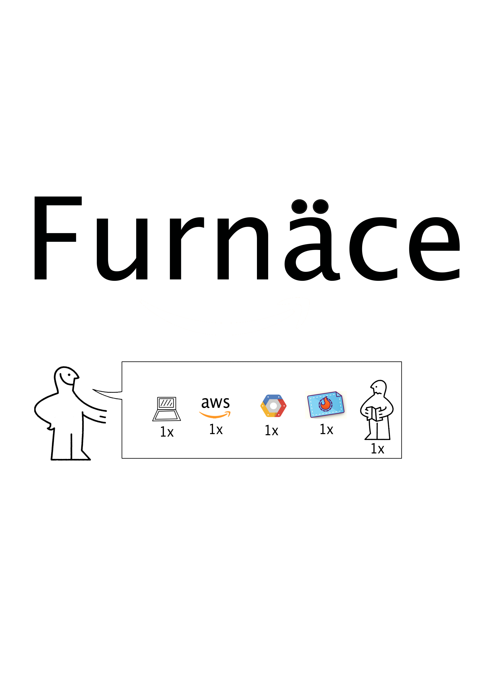
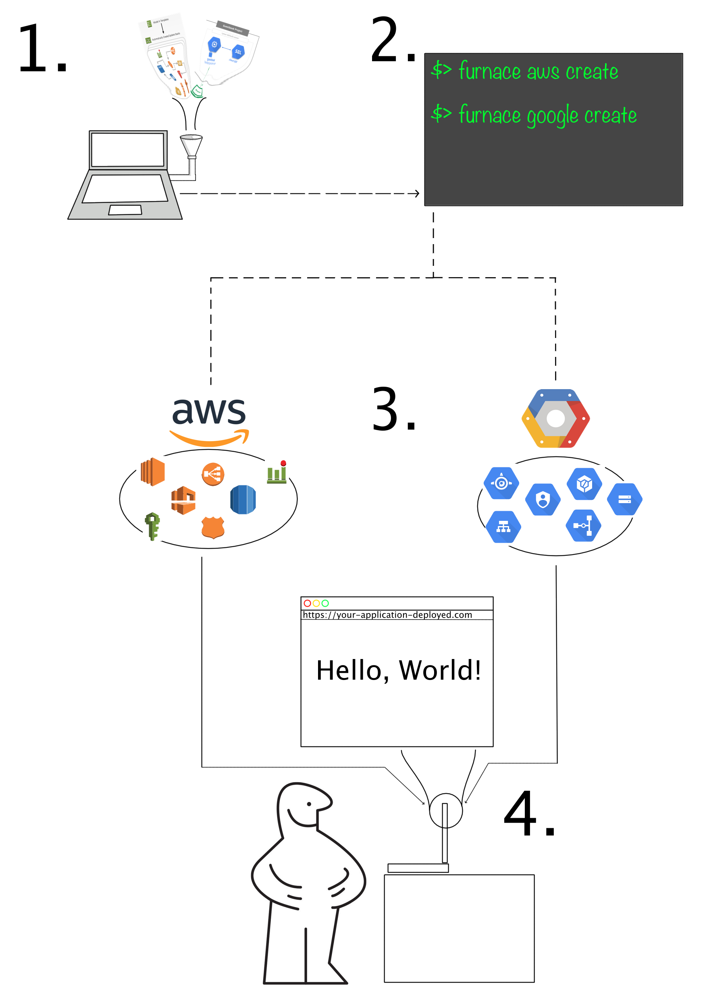
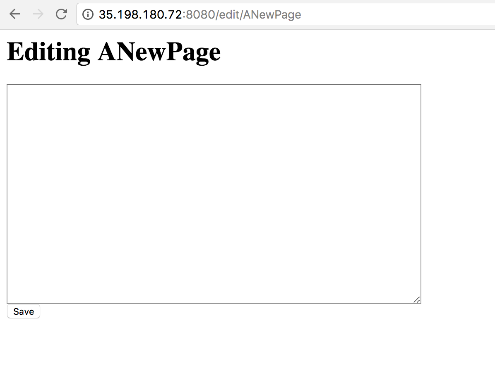

# Furnace

Pre-built binaries are now available at: [Furnace Website](https://skarlso.github.io/furnace-web/).


[](https://goreportcard.com/report/github.com/Skarlso/go-furnace) [](https://travis-ci.org/Skarlso/go-furnace)
[](https://coveralls.io/github/Skarlso/go-furnace?branch=master)

## Intro

## Brief Explanation

Here is a very short description of what Furnace does in a handy IKEA manual format.




## In More Depth

AWS Cloud Formation hosting with Go. This project utilizes the power of AWS CloudFormation and CodeDeploy in order to
simply deploy an application into a robust, self-healing, redundant environment. The environment is configurable through
the CloudFormation Template. A sample can be found in the `templates` folder.

The application to be deployed is handled via GitHub, or S3.

A sample application is provider under the `furnace-codedeploy-app` folder.

## Installing Binaries

### Go Install

To install all generated binaries at once, run:

```bash
# Download / Clone the latest version
# cd into go-furnace
make install-all
```

This will install all dependencies and both binaries to `$GOPATH/bin` folder.

### Make commands

You can also build the commands which will be output into the `cmd` sub-folder.

```bash
# Simply run make from the root folder
make
```

### Building for different environment

Convinient targets are provided for linux and windows binaries.

```bash
make linux
make windows
```

These are only available from the package folders respectively.

### Clean

In case `make install` is used, a clean-up target is also provided.

```bash
make clean-all
```

## AWS

### CloudFormation

[CloudFormation](https://aws.amazon.com/cloudformation/) as stated in the AWS documentation is an
> ...easy way to create and manage a collection of related AWS resources, provisioning and updating them in an orderly and predictable fashion.

Meaning, that via a template file it is possible to provide a description of the environment we would like to launch
are application into. How many server we would like to have? Load Balancing, and Auto Scaling setup. Own, isolated
network with VPCs. CloudFormation brings all these elements together into a bundler project called a `Stack`.
This stack can be created, updated, deleted and queried for various information.

This is what `Furnace` aims to abstract in order to provide a very easy interface to work with complex architecture.

### CodeDeploy

[CodeDeploy](http://docs.aws.amazon.com/codedeploy/latest/userguide/welcome.html), as the documentation states
> ...coordinates application deployments to Amazon EC2 instances

In short, once the stack is up, we would like to deploy our application to the stack for usage. CodeDeploy takes care of that.
We don't have to scp something to our instances, we don't have to care if an instance goes away, or if we would like to have
a copy of that same instance. CodeDeploy can be integrated with various other services, so once we described how to deploy
our application, we never have to worry about it again. A simple `furnace push` will install our app to every instance that
the `Stack` manages.

Don't forget to install the CodeDeploy agent to your instances for the CodeDeploy to work. For this, see an example in the
provided template.

## Go

The decision to use [Go](https://golang.org/) for this project came very easy considering the many benefits Go provides when
handling APIs and async requests. Downloading massive files from S3 in threads, or starting many services at once is a breeze.
Go also provides a single binary which is easy to put on the execution path and use `Furnace` from any location.

Go has ample libraries which come to aid with AWS and their own Go SDK is pretty mature and stable.

## Usage

### Make

This project is using a `Makefile` for it's build processes. The following commands will create a binary and
run all tests:

```bash
make build test
```

`make install` will install the binary in your `$GOHOME\bin` path. Though the binary will be named `go-furnace`.

For other targets, please consult the Makefile.

### Configuration

Furnace uses convention for configuration and YAML. This works as follows.

Since furnace is a distributable binary, it looks for a configuration called `.teststack.furnace` in the current running
directory. If it fails to find one, it will go up one level and search there, until it can't go any more up. It will leave
out `\` for searching. This is achieved by simply running `furnace-aws create teststack`. Or `furnace-aws status teststack`.
If the file doesn't exists, furnace will throw an error.

The parameter is optional. If not provided, furnace will look for it's default configuration files under `~/.config/go-furnace`.

The `.teststack.furnace` file contains a single entry, looking like this:

```bash
stacks/aws_config.yaml
```

This entry tells Furnace where to look for the given stack's configuration yaml file.
The configuration file for AWS looks like this:

```yaml
main:
  stackname: FurnaceStack
  spinner: 1
aws:
  code_deploy_role: CodeDeployServiceRole
  region: us-east-1
  enable_plugin_system: false
  template_name: cloud_formation.template
  app_name: furnace_app
  code_deploy:
    # Only needed in case S3 is used for code deployment
    code_deploy_s3_bucket: furnace_code_bucket
    # The name of the zip file in case it's on a bucket
    code_deploy_s3_key: furnace_deploy_app
    # In case a Git Repository is used for the application, define these two settings
    git_account: Skarlso/furnace-codedeploy-app
    git_revision: b89451234...
```

The configuration file for GCP looks like this:

```yaml
main:
  project_name: test-123
  spinner: 1
gcp:
  template_name: google_template.yaml
  stack_name: test2-stack
```

Notice that the name of the stack template file does not contain a directory. The stack template file must be located next to configuration file.

CodeDeploy further requires an IAM policy on the current user in order to be able to handle ASG and deploying to the EC2 instances. For this, a regular IAM role can be created from the AWS console. The name of the IAM profile can be configured later when pushing, if that is not set, the default is used which is `CodeDeployServiceRole`. This role can also be created via the CloudFormation stack template.

This setup allows for multiple stacks for a single project as long as the corresponding `.furnace` file exists; giving much more flexibility to the user.

### AWS Commands

Furnace provides the following commands (which you can check by running `./furnace`):

```bash
❯ ./furnace-aws help
delete custom-config               Delete a stack
push custom-config [-s3]           Push to stack
delete-application custom-config   Deletes an Application
update custom-config               Update a stack
status custom-config               Status of a stack.
create custom-config                  Create a stack
help [command]                     Display this help or a command specific help
```

Create and Delete will wait for the these actions to complete via a Waiter function. The waiters spinner type
can be set via the env property `FURNACE_SPINNER`. This is optional. The following spinners are available:

```go
// Spinners is a collection os spinner types
var Spinners = []string{`←↖↑↗→↘↓↙`,
	`▁▃▄▅▆▇█▇▆▅▄▃`,
	`┤┘┴└├┌┬┐`,
	`◰◳◲◱`,
	`◴◷◶◵`,
	`◐◓◑◒`,
	`⣾⣽⣻⢿⡿⣟⣯⣷`,
	`|/-\`}
```

The spinner defaults to `|/-\` which is # 7.

#### create

This will create the whole stack via the configuration provided under templates.


As you can see, furnace will ask for the parameters that reside in a template. If default is desired, simply
hit enter to continue using the default value.

#### delete

Deletes the whole stack complete with everything attached to the stack expect for the CodeDeploy application.


#### push

This is the command to get your application to be deployed onto all of your configured instances. This works via
two things. AutoScaling groups provided by the CloudFormation stack plus Tags that are put onto the instances called
`fu_stage`.


Push works with two revision locations.

##### GitHub

The default for a push is to locate a sample application on Github which will then be deployed.

##### S3

To use S3 for deployment, push needs an additional flag like this: `furnace-aws push --s3`.

Bucket is a unique bucket which is used to store a zipped version of the application. The key is the name of the object.
Access to the bucket needs to be defined in the CloudFormation template via an IAM Role. A sample is provided in the
template under the `templates` folder.

#### delete-application

Will delete the application and the deployment group completely.

#### successful push

If you are using the provided example and everything works, you should see the following output once you visit the
url provided by the load balancer.


#### status

The status command displays information about the stack.


## Plugins

### Experimental Plug-in System

To use the plugin system, please look at the example plugins in project [furnace-plugins](https://github.com/Skarlso/furnace-plugins).
At the moment, plugins are not receiving the environment for further manipulations; however, this will be remedied.

A plugin is a standalone go project with main package, and a single entry point function called `RunPlugin`. If the plugin fails
to provide that function it will not be loaded. Plugins have to be placed under `~/.config/go-furnace/plugins`. Their extension decide
at what stage they will be loaded. Extensions should be one of the following: `pre_create, post_create, pre_delete, post_delete`. If not,
the plugin will simple be ignored. Well, technically it will be loaded, just not used.

To build the plugin run `go build -buildmode=plugin -o myplugin.pre_create myplugin.go`. Than copy the `.pre_create` to said folder. And
that's it, you should be all set.

Plugins are loaded as encountered, so if order of execution is important, pre_fix the file names with numbers.

**IMPORTANT**: Plugins are only supported on Linux right now. If you would like to play with it, I recommend using the official Docker golang
container which is easy to use. To link your project into the container, run it with the following command from the root of your project:

```bash
docker run --name furnace -it -v `pwd`:/go/src/github.com/Skarlso/go-furnace golang bash
```

Should any question arise, please don't hesitate to open an issue with the PreFix [Question].

### Slack Plugin

An example for a notification plugin after a stack has been created could look something like this:

```go
package main

import (
	"fmt"
	"os"

	"github.com/nlopes/slack"
)

func RunPlugin() {
	stackname := os.Getenv("FURNACE_STACKNAME")
	api := slack.New("YOUR_TOKEN_HERE")
	params := slack.PostMessageParameters{}
	channelID, timestamp, err := api.PostMessage("#general", fmt.Sprintf("Stack with name '%s' is Done.", stackname), params)
	if err != nil {
		fmt.Printf("%s\n", err)
		return
	}
	fmt.Printf("Message successfully sent to channel %s at %s", channelID, timestamp)
}
```

## Configuration Management

Any kind of Configuration Management needs to be implemented by the application which is deployed.

That means that changes are applied to the `appspec.yml` file and the structure of the application itself.

For further examples checkout the AWS codedeploy example: [AwsLabs](https://github.com/awslabs/aws-codedeploy-samples).

## Testing

Testing the project for development is simply by executing `make test`.

## Google Cloud

Google Cloud integration is a work in progress. Expect further update as it continue to be implemented.

Currently the supported and fully functional commands are:

```bash
❯ ./furnace-gcp help
delete custom-config           Delete a Google Deployment Manager
status [--config=configFile]   Get the status of an existing Deployment Management group.
create custom-config           Create a Google Deployment Manager
help [command]                 Display this help or a command specific help
```

### Authentication with Google

Please carefully read and follow the instruction outlined in this document: [Google Cloud Getting Started](https://cloud.google.com/sdk/#Quick_Start). It will describe how to download and install the SDK and initialize cloud to a Project Name and ID.

Take special attention to these documents:

[Initializing GCloud Tools](https://cloud.google.com/sdk/docs/initializing)
[Authorizing Tools](https://cloud.google.com/sdk/docs/authorizing)

Furnace uses a Google Key-File to authenticate with your Google Cloud Account and Project.
In the future, Furnace assumes these things are properly set up and in working order.

### Deployment Manager

Furnace uses Google Cloud's [Cloud Deployment Manager](https://cloud.google.com/deployment-manager/) service.
This service is similar to AWS' CloudFormation. It utilizes a YAML based configuration file and templates.
Templates use Python's [Jinja2](http://jinja.pocoo.org/) which is a fully featured template engine.

#### Templates

You can find a LOT of good templates samples located here: [GloudPlatform Deployment Samples](https://github.com/GoogleCloudPlatform/deploymentmanager-samples). Furnace provides two examples. A simpler example can be seen in `./templates/google_template.yaml`. It will create a simple architecture with Load Balancing and Auto Scaling and deploy a Go Web App sample application located here: [Go Simple Wiki](https://github.com/Skarlso/furnace-google-cloud-app). It's Go's simple Wiki example app.

If deployed successfully, you should be able to access it like this:

.

The second example can be located in `./templates/google_template.bookshelf.yaml`. This example deploys Google's sample Python App located here: [Python Getting Started](https://github.com/GoogleCloudPlatform/getting-started-python/tree/master/7-gce).

In order to use the templates, name the main template `google_template.yaml` and copy it into the Furnace configuration folder under `~/.config/go-furnace`. In the future, Furnace will have this configurable. Maybe :).

#### Configuring a Deployment

*Note: The following section describes how to deploy the sample Go application.*

##### Setup

Project-ID should be set to your desired project name's ID with which to work with.

##### Update the template

Everything else, like region, is configured through the provided Google Templates. All attached `includes` and schema files are automatically added to the configuration. They should, however, live next to the template.

##### Startup Script

###### Store your startup script in a bucket

A startup script is what's used in order to bootstrap the instances. Furnace doesn't interpolate a script if it is attached, so rather use a bucket which contains the startup script and use `startup-script-url` template variable to define its location like this:

```yaml
      metadata:
        items:
          - key: startup-script-url
            value: gs://{{ properties["bucket"] }}/startup-script.sh
```

###### In-line with import

Right now, furnace doesn't provide an import from a schema file. A future version will have that luxury. The sample bookshelf template contains an example of that.

###### Raw in-line

You could always just in-line the script in the template directly.

### Creating a Deployment

After everything has been properly configure, execute:

```bash
./furnace-gcp create
```

This will display information like this:

```bash
~/golang/src/github.com/Skarlso/go-furnace extend_with_subcommand*
❯ ./furnace-gcp create
2017/11/03 07:14:47 Creating Deployment under project name: . testplatform-180405
2017/11/03 07:14:47 Deployment name is:  furnace-stack
2017/11/03 07:14:47 Found the following import files:  [{./simple_template.jinja simple_template.jinja}]
2017/11/03 07:14:47 Adding template name:  simple_template.jinja
2017/11/03 07:14:47 Looking for schema file for:  ./simple_template.jinja
2017/11/03 07:14:47 Schema to look for is:  /Users/hannibal/.config/go-furnace/simple_template.jinja.schema
[/] Waiting for state: DONE
```

### Deleting a Deployment

Once the stack is no longer needed, run the following command:

```bash
./furnace-gcp delete
```

Which will output this information:

```bash
~/golang/src/github.com/Skarlso/go-furnace extend_with_subcommand* 51s
❯ ./furnace-gcp delete
2017/11/03 07:17:38 Deleteing Deployment Under Project:  testplatform-180405
[-] Waiting for state: DONE
Stack terminated!
```

### Status of Deployment

Status can be retrieved using the following command:

```bash
./furnace-gcp status
```

This will output information about the deployment including the manifest file which includes all of the created resources with the deployment. This will look like the following output:

```bash
~/golang/src/github.com/Skarlso/go-furnace extend_with_subcommand* 1m 8s
❯ ./furnace-gcp status
2017/11/01 21:37:39 Status of Deployment under project name: . testplatform-180405
2017/11/01 21:37:39 Deployment name is:  furnace-stack
2017/11/01 21:37:41 Description:
2017/11/01 21:37:41 Name:  furnace-stack
2017/11/01 21:37:41 Labels:  []
2017/11/01 21:37:41 Selflink:  https://www.googleapis.com/deploymentmanager/v2/projects/testplatform-180405/global/deployments/furnace-stack
2017/11/01 21:37:41
Layout:
 resources:
- name: template
  properties:
    bucket: testplatform-180405.appspot.com
    machine-image: https://www.googleapis.com/compute/v1/projects/debian-cloud/global/images/family/debian-8
    machine-type: f1-micro
    max-instances: 1
    min-instances: 1
    scopes:
    - https://www.googleapis.com/auth/cloud-platform
    target-utilization: 0.6
    zone: europe-west3-a
  resources:
  - name: bookshelf-furnace-stack
    type: compute.v1.instanceTemplate
  - name: bookshelf-furnace-stack-frontend-group
    type: compute.v1.instanceGroupManager
  - name: bookshelf-furnace-stack-health-check
    type: compute.v1.httpHealthCheck
  - name: bookshelf-furnace-stack-frontend
    type: compute.v1.backendService
  - name: bookshelf-furnace-stack-frontend-map
    type: compute.v1.urlMap
  - name: bookshelf-furnace-stack-frontend-proxy
    type: compute.v1.targetHttpProxy
  - name: bookshelf-furnace-stack-frontend-http-rule
    type: compute.v1.globalForwardingRule
  - name: bookshelf-furnace-stack-autoscaler
    type: compute.v1.autoscaler
  - name: bookshelf-furnace-stack-allow-http
    type: compute.v1.firewall
  type: template.jinja
```

## DigitalOcean

Furnace now supports DigitalOcean. This is really through a library called [Yogsothoth](https://github.com/Skarlso/yogsothoth). Yogsothoth aims to provide the same experience to DigitalOcean assets that does CloudFormation for AWS services.

This means, that there is a configuration template that describes a set of resources bundled together beneath an umbrella called stack.

This library is in Alpha and only supports Droplets for now. Slowly more resources and features will be available much like the templates of CF and GCP.

### Commands

For now, only `create` is done. This will be improved rapidly as more functionality is available through Yogsothoth.

## Dep

Furnace is now using `dep` to manage it's dependencies.

## Separate binaries

In order to try and minimize the binary size of furnace, it has separate binaries for each service it provides.

You can find `furnace-aws` under `aws` and `furnace-gcp` under `gcp`. This way, if you plan on using only aws you don't need to worry about dependencies for Google, and vica-versa.

## Contributions

Contributions are very welcomed, ideas, questions, remarks, please don't hesitate to submit a ticket. On what to do,
please take a look at the ROADMAP.md file or under the Issues tab.
